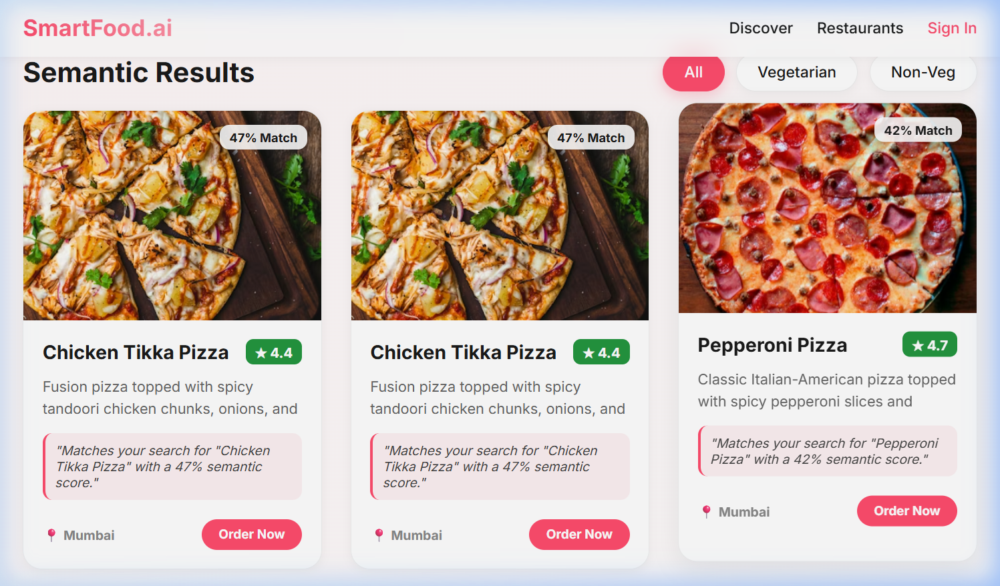
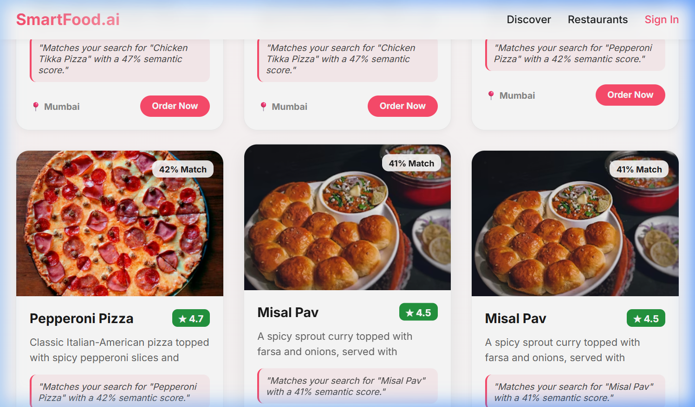
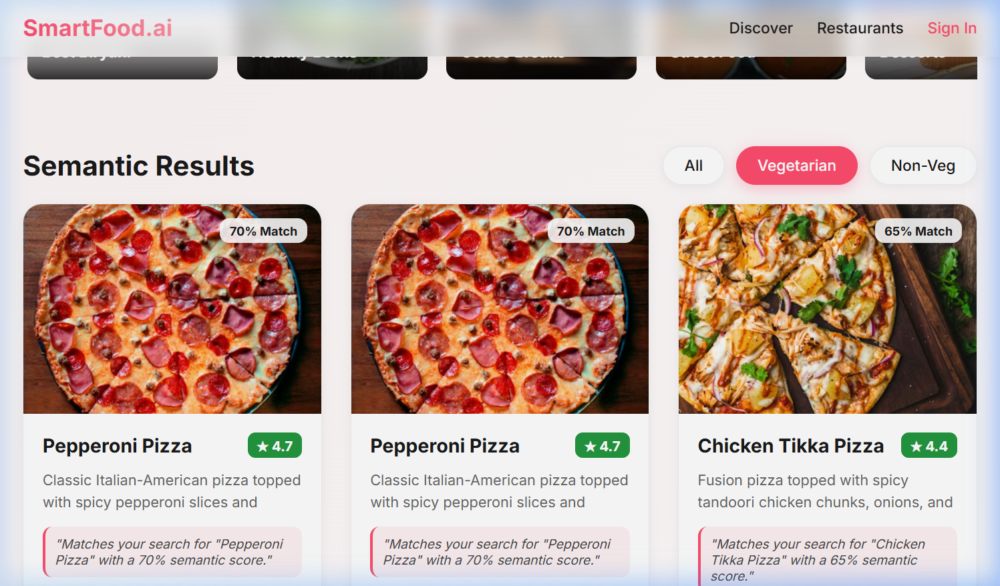

# AI Food Recommendation and Semantic Search App

This project is a food discovery and recommendation platform built using a vector database. It allows users to search for dishes using natural language rather than just keywords and provides personalized suggestions based on their search behavior. 

This project was built as part of a placement assignment using Endee vector database.

## Problem Statement

Traditional food search systems depend on exact keyword matching. For example, if a user searches for "something spicy and heavy" on a platform that only uses basic keyword filters, they might not find relevant results unless those specific words appear in a dish's title.

This application uses semantic search to understand the context and intent of a query. By converting text into vector embeddings, the system can find dishes that are conceptually similar to the user's request, even if the exact words do not match.

## Features

- **Semantic Search**: Uses vector embeddings to find relevant dishes based on natural language queries.
- **Recommendation System**: Suggests dishes by analyzing the user's recent search history and overall dish ratings.
- **Dietary Filtering**: Includes logic to strictly filter results by Veg or Non-Veg types post-retrieval.
- **Hybrid Ranking**: Combines semantic similarity with user ratings and tag matching to provide more accurate results.
- **Automated Explanations**: Provides a simple reason for why each dish was matched or recommended.
- **Frontend UI**: A clean interface for searching, filtering, and viewing results with autocomplete suggestions.

## Tech Stack

- **Backend**: Python, Flask
- **Vector Database**: Endee
- **Frontend**: React, Vite
- **Embeddings**: Sentence-transformers (`all-MiniLM-L6-v2`)

## System Design

The application follows a standard retrieval-augmented flow to serve search results and recommendations. 


### How Endee is Used

Endee is used as the primary retrieval engine for the application:
1. **Storing Data**: Food metadata (name, description, tags) is converted into 384-dimensional vectors and stored in an Endee collection.
2. **Similarity Search**: User queries are converted into vectors in real-time and matched against the collection using vector similarity.
3. **Recommendation Retrieval**: Search history is used to build a context vector, which is then used to retrieve relevant items from Endee for the recommendations section.

## How to Run

### Endee (Vector Database)

The easiest way to run the Endee server is via Docker:

```bash
docker run -p 8080:8080 endeeio/endee-server:latest
```

Ensure the server is running at `http://localhost:8080` before starting the backend.

### Backend

1. Navigate to the backend directory:
   ```bash
   cd backend
   ```
2. Install the required dependencies:
   ```bash
   pip install -r requirements.txt
   ```
3. Set up the environment variables:
   ```bash
   cp .env.example .env
   ```
4. Seed the database with initial food data:
   ```bash
   python reseed_db.py
   ```
5. Start the Flask server:
   ```bash
   python app.py
   ```

### Frontend

1. Navigate to the frontend directory:
   ```bash
   cd frontend
   ```
2. Install the node packages:
   ```bash
   npm install
   ```
3. Start the development server:
   ```bash
   npm run dev
   ```

## Example Usage

- Searching for **"spicy food"** will return results like Indian curries and Szechuan dishes.
- Searching for **"healthy breakfast"** will suggest salads, smoothies, and light toasts even if the word "healthy" isn't in their name.
- Selecting the **"Veg"** filter will ensure only vegetarian items are displayed, even if a non-veg item is a close semantic match.

## Screenshots

Below are some sample outputs from the application:






## Future Improvements

- **User Authentication**: Implementing user accounts to persist search history across sessions.
- **Dynamic Data Entry**: Allowing users or restaurant owners to add new food items directly through the UI.
- **Enhanced Recommendation Model**: Incorporating collaborative filtering for more sophisticated personalization.
- **Larger Dataset**: Expanding the database to include a wider variety of global cuisines and nutritional data.

---

This project was built as part of a placement assignment using Endee vector database.
